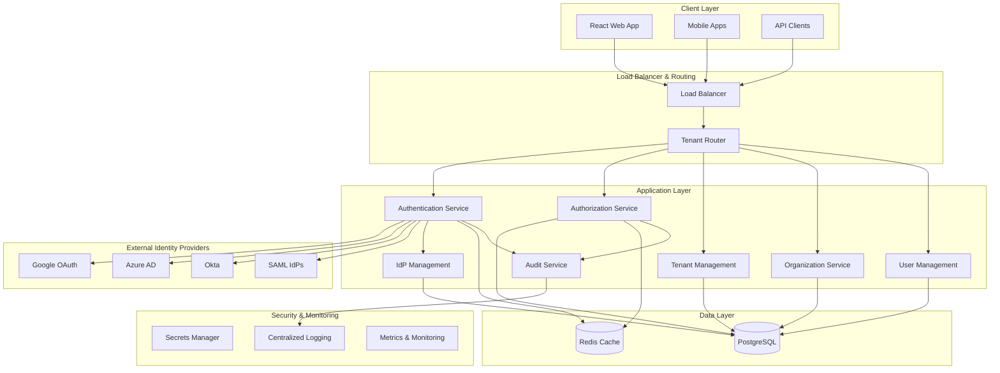
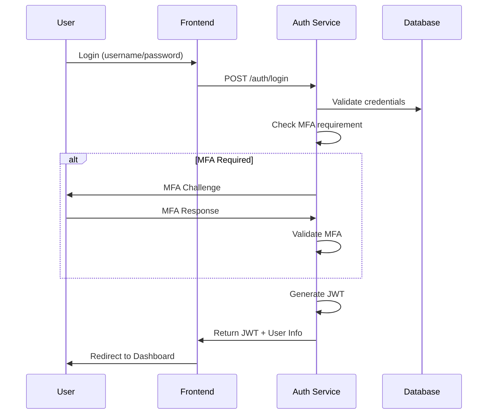
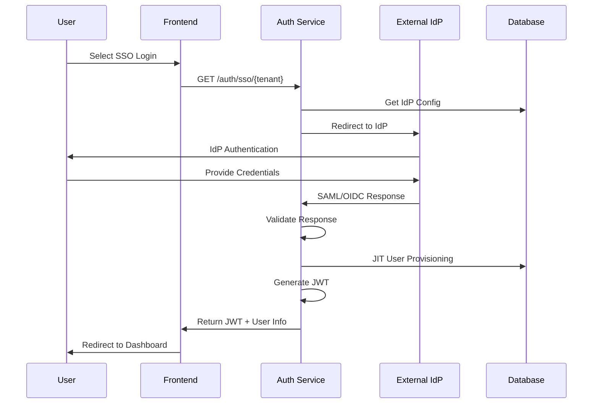

# IAM System Architecture

## High-Level Architecture Diagram



## Component Descriptions

### Frontend (React)
- **Login Interface**: Multi-tenant login with SSO options
- **Dashboard**: Organization and account management
- **User Management**: User provisioning and role assignment
- **Admin Panel**: Tenant configuration and IdP setup

### Backend Services (NestJS)

#### Authentication Service
- Native username/password authentication
- MFA implementation (TOTP, SMS)
- Federated SSO (SAML, OIDC)
- JWT token management
- Break-glass admin access

#### Authorization Service
- Role-Based Access Control (RBAC)
- Policy evaluation engine
- Organization/account-level permissions
- Resource access control

#### Tenant Management Service
- Tenant onboarding and configuration
- Subdomain routing
- Tenant isolation enforcement
- Billing and usage tracking

#### Organization Service
- Multi-account structure management
- Hierarchical organization model
- Cross-account role delegation
- Organization-wide policies

#### User Management Service
- User provisioning (manual and SCIM)
- Just-in-time (JIT) user creation
- Group management
- User lifecycle management

#### IdP Management Service
- IdP registration and validation
- Domain ownership verification
- Metadata management
- IdP uniqueness enforcement

#### Audit Service
- Comprehensive event logging
- Security event monitoring
- Compliance reporting
- Activity tracking

### Database Design

#### Core Entities
1. **Tenants**: Root entity for isolation
2. **Organizations**: Top-level business entity
3. **Accounts**: Sub-organizations (dev, staging, prod)
4. **Users**: Individual user accounts
5. **Roles**: Permission containers
6. **Policies**: Fine-grained access rules
7. **IdPs**: External identity provider configurations
8. **Sessions**: Active user sessions
9. **Audit_Logs**: Security and activity logs

## Multi-Tenancy Strategy

### Tenant Isolation
- **Database Level**: Tenant ID in all tables with RLS policies
- **Application Level**: Tenant context in all requests
- **Network Level**: Subdomain-based routing
- **Data Level**: Encrypted tenant-specific data

### Tenant Routing
```
tenant-a.tenantguard.com → Tenant A context
tenant-b.tenantguard.com → Tenant B context
api.tenantguard.com/tenant/{id} → API with tenant context
```

## Authentication Flows

### Native Authentication Flow


### Federated SSO Flow


## Security Controls

### IdP Validation
1. **Metadata Validation**: Verify IdP metadata and certificates
2. **Domain Ownership**: DNS verification for domain claims
3. **Entity ID Uniqueness**: Prevent IdP sharing across tenants
4. **Certificate Validation**: X.509 certificate verification

### Token Security
1. **JWT Signing**: RSA/ECDSA signatures
2. **Token Rotation**: Automatic refresh token rotation
3. **Scope Limitation**: Principle of least privilege
4. **Expiration Policies**: Configurable token lifetimes

### Audit & Compliance
1. **Event Logging**: All authentication and authorization events
2. **Security Monitoring**: Failed login detection
3. **Compliance Reporting**: SOC2, ISO27001 compliance
4. **Data Retention**: Configurable log retention policies

## Scalability Considerations

### Horizontal Scaling
- Stateless service design
- Redis for shared state
- Database connection pooling
- Load balancer health checks

### Performance Optimization
- JWT caching in Redis
- Database indexing strategy
- Connection pooling
- CDN for static assets

### High Availability
- Multi-region deployment
- Database replication
- Circuit breaker patterns
- Graceful degradation